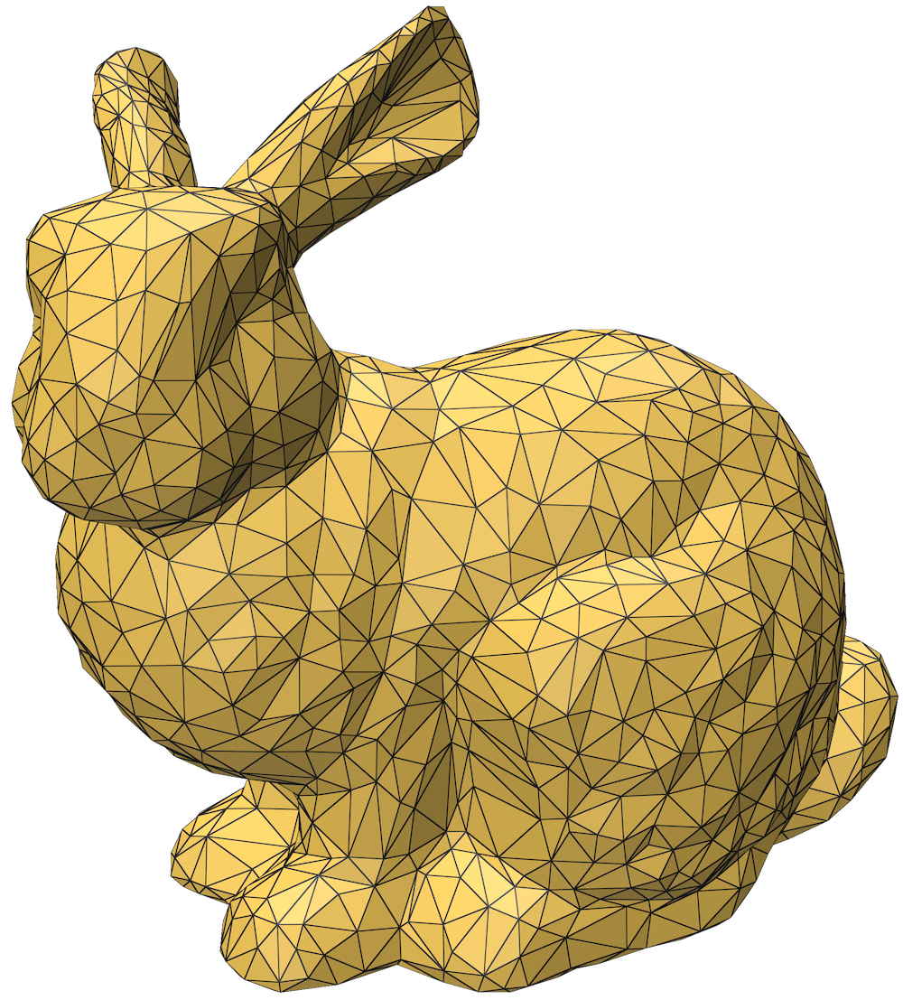
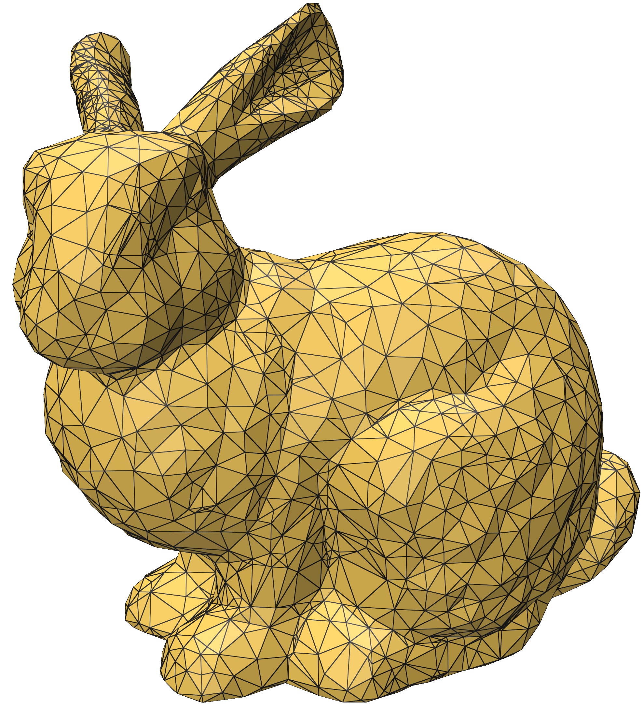

# Split To Delaunay

This is a rough implementation of the Delaunay edge split algorithm presented in [Efficient construction and simplification of Delaunay meshes](https://dl.acm.org/doi/10.1145/2816795.2818076) by Yong-Jin Liu, Chunxu  Xu, Dian  Fan, and Ying He. It takes in a triangle mesh and then performs edge splits to make the mesh Delaunay.

|||
|:----:|:-----:|
|Original Mesh|Delaunay Mesh|


This repo uses submodules. To clone it along with the submodules, run `git clone --recursive https://github.com/MarkGillespie/SplitToDelaunay.git`. To build the code, make a `build` directory in the main folder. Then run 
```
cd build
cmake ..
make -j7
```
Run the code with

Then run the code with
```
bin/run /path/to/a/mesh
```

You can run the tests with
```
bin/test
```
